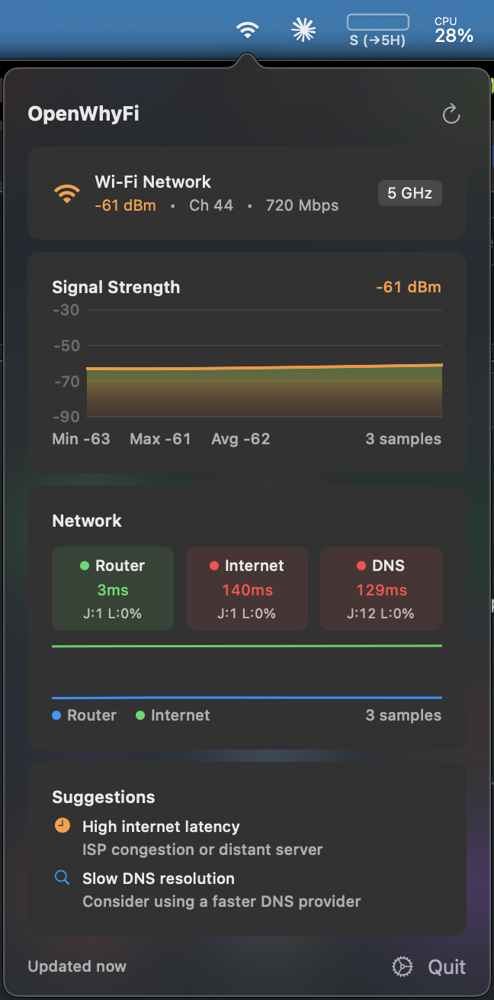

# OpenWhyFi

A macOS menu bar app that monitors your Wi-Fi and network health in real-time.



## Features

- **Wi-Fi Info** - SSID, signal strength (dBm), channel, band (2.4/5 GHz), link speed
- **Signal Strength Chart** - Real-time signal history with min/max/avg stats
- **Network Latency** - Ping times to router, internet, and DNS with jitter/loss tracking
- **Smart Suggestions** - Actionable tips based on current network conditions
- **Menu Bar App** - Lives in your menu bar, one click to check status

## Installation

**Option 1:** Download via Terminal (recommended):
```bash
curl -L https://github.com/wiktorkowalski/openwhyfi/releases/latest/download/OpenWhyFi.zip -o OpenWhyFi.zip && unzip OpenWhyFi.zip
```

**Option 2:** Download from [Releases](https://github.com/wiktorkowalski/openwhyfi/releases), then run:
```bash
xattr -cr ~/Downloads/OpenWhyFi.app
```

Then move to Applications and open.

## Requirements

- macOS 13.0+
- Apple Silicon (arm64)

## Building from Source

```bash
git clone https://github.com/wiktorkowalski/openwhyfi.git
cd openwhyfi
xcodebuild -project OpenWhyFi.xcodeproj -scheme OpenWhyFi -configuration Release
```
